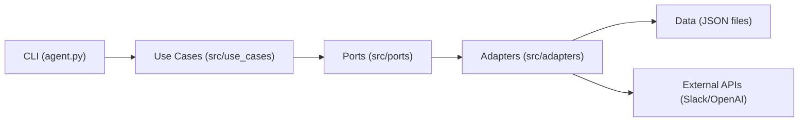

# Specs Updates Generator

A CLI tool to automatically process Slack discussions and generate specification updates using AI classification.

## Features

- **Slack Integration**: Fetch and normalize Slack threads
- **AI Classification**: Automatically classify discussions as Open Questions (OQ) or Proposed Updates (PU)
- **Traceability**: Full audit trail of all processed data

## Setup

1. **Install dependencies**:
   ```bash
   pip install slack-sdk openai python-dotenv
   ```

2. **Configure environment variables**:
   ```bash
   cp .env.example .env
   # Edit .env with your credentials
   ```

3. **Initialize sync point**:
   ```bash
   python agent.py init_sync
   ```

## Usage

### Available Commands

- `python agent.py ingest` - Fetch and classify new Slack threads
- `python agent.py art_list` - List all artifacts
- `python agent.py oq_list` - List all open questions
- `python agent.py pu_list` - List all proposed updates
- `python agent.py artifact_transform` - Transform artifacts to OQ/PU
- `python agent.py oq_decide <oq_id>` - Add decision + rationale to an OQ
- `python agent.py oq_modify <oq_id>` - Modify fields of an OQ (question/context/decision/rationale)
- `python agent.py oq_transform` - Convert decided OQs to PUs (batch)
- `python agent.py oq_delete <oq_id>` - Delete an OQ and mark its artifact IRRELEVANT
- `python agent.py oq_delete <id1> <id2> ...` - Batch delete OQs
- `python agent.py publish_oq <id1> <id2> ...` - Publish OQs to Slack (republish only if modified)
- `python agent.py approve_pu <pu_id>` - Approve a proposed update
- `python agent.py change_status <id1> <id2> ... <status>` - Change status for one or more artifacts
- `python agent.py change_status --status <status> <id1> <id2> ...` - Alternative syntax
- `python agent.py init_sync` - Initialize sync timestamp (skip history)
- `python agent.py set_last_ts --days <n>` - Set last_ts to N days back (asks if missing)
- `python agent.py reset_data` - Clear all stored JSON data (asks for confirmation)
- `python agent.py reset_data --yes` - Clear data without prompt

### UI (Desktop)

1. Install UI dependency:
   ```bash
   pip install pyside6
   ```

2. Launch the UI from the project root:
   ```bash
   python ui.py
   ```

### Tests

- `make test` - Run all tests

## Workflow

1. **Ingest**: Fetch Slack threads → Create Artifacts
2. **Transform**: Artifacts → Open Questions or Proposed Updates
3. **Decide**: Open Questions + Decisions → Proposed Updates
4. **Approve**: Proposed Updates → Spec Updates

## Data Storage

All data is stored in `data/` directory:
- `artifacts.json` - Classified discussions
- `open_questions.json` - Questions requiring decisions
- `proposed_updates.json` - Updates pending approval
- `specs_updates.json` - Approved specification changes
- `slack_threads.json` - Raw Slack data (traceability)
- `conversations.json` - Normalized conversations (traceability)

## Architecture Overview (Hexagonal)

This project follows a hexagonal (ports & adapters) structure:

- `src/domain/` - Core business models (Artifacts, OQ, PU, SpecUpdate)
- `src/ports/` - Interfaces (repositories, Slack, LLM, traceability)
- `src/use_cases/` - Business logic (ingest, transform, approve, modify)
- `src/adapters/` - Concrete implementations (JSON storage, Slack SDK, OpenAI)
- `src/cli/wiring.py` - Centralized wiring of use cases + adapters
- `agent.py` - Thin CLI entrypoint that calls use cases



## License

MIT
